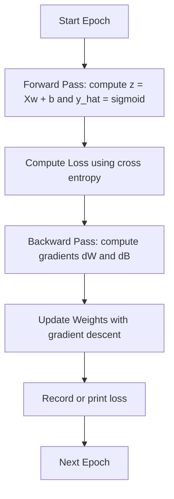

# numpy-logistic-regression
Logistic Regression From Scratch (NumPy)

Logistic regression is an ML model that is used to predicte binary probability outcome such as chances it might rain, or a customer returning(churn) 

It works by training the model on existing data to find a linear boundary in the feature space that minimizes prediction error, and then applying the sigmoid function to convert the linear output into a probability.

The training starts with random weights then it runs for many iterations and on each iteration the predication is measured against the labels to determine the loss using CrossEntropy loss function: L = -[y log(y-hat) + (1-y) log(1-y-hat)] 

Forward pass: (Linear → Sigmoid → Loss → Gradients)

After that the gradient vlaue is calculated to update the weights based on the error to go up or down, the gradient decent function is calculated using the chain rule:

(Loss → Sigmoid → Linear → Weights)

At the end of training, we find the weights that minimize the cross-entropy loss, so the predicted probabilities match the labels as closely as possible.

```
logistic-regression/
│
├── src/
│   └── model.py
│
├── notebooks/
│   └── training.ipynb
│
└── README.md
```

*Training Flow*

